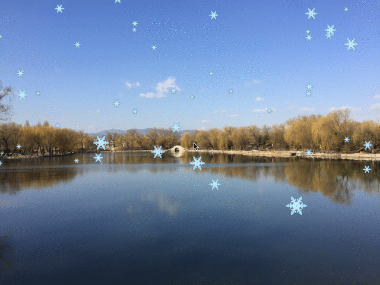

# Snow Flake Effect



## Usage
On Mac, we can directly run this program by `./a` under this directory.

To compile and run, use 

```
g++ -std=c++11 -stdlib=libc++ -lglfw3 -framework CoreVideo -framework OpenGL -framework IOKit -framework Cocoa -framework GLUT -o a ../libSOIL.a main.cpp ../glad.c
```

## Functionalities
This project uses `snow.JPG` to create the shown effect on a background image.

We use particle system as representation of these flakes and let them run according to physical rule, where $ F = -mg + Dv $.

## Notice
There seem no easy way to convert white pixels to transparent ones. Therefore we did that manually.