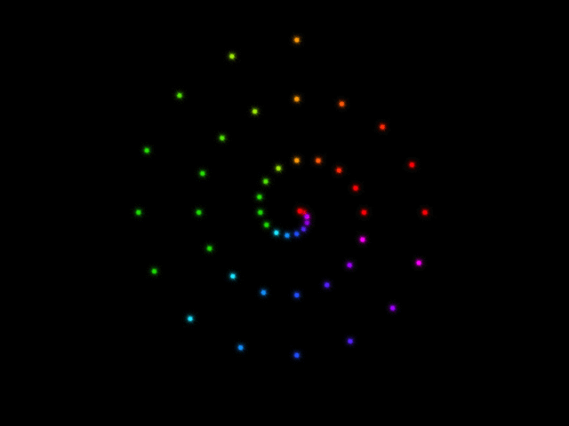

# OpenGL Usage

## First Project
In folder `/hw1`.

This project enables several functions in the displaying window.

* object rotation (up, down, left, right, M, N keys)
* object movement (W, S, A, D, Z, X keys)
* display mode selection (P, F, L, O keys)
* color gradual change (R, G, B keys)

### Display Mode Selection
P: only display points
F: display triangles, in random colors
L: only display lines
O: display both triangle faces and lines

### Color Gradual Change
R, G, B represent red, green, and blue elements in the color, respectively. When we keep pressing R, for example, the red element will be fluctuating in a sinusoidal pattern. We can also press several keys at the same time.

## Second Project

This project displays an Archimedes' Screw. See folder `hw2` for details.

## Third Project

This project draws snow flakes with particle system.