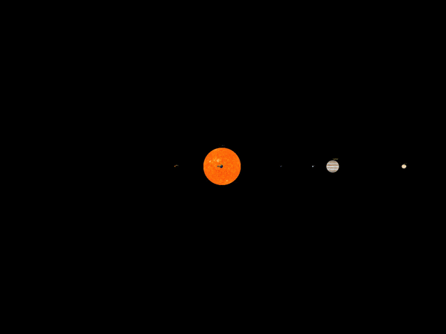
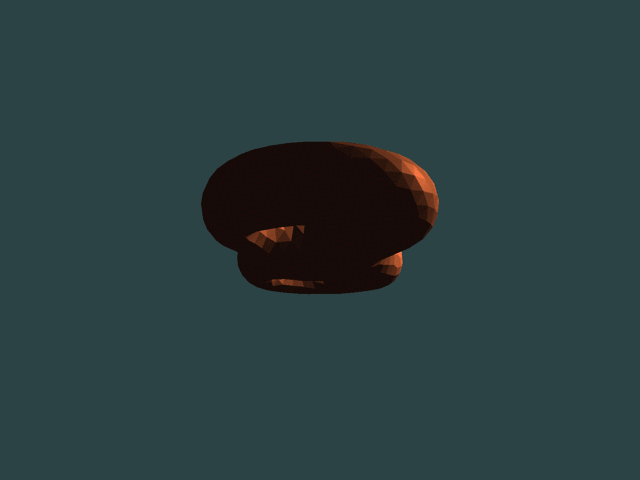
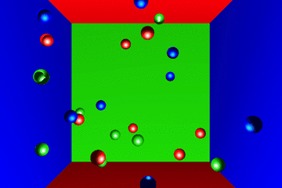
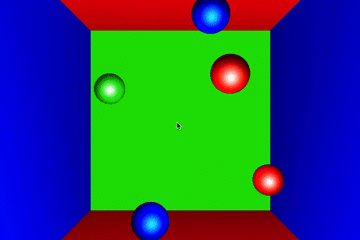
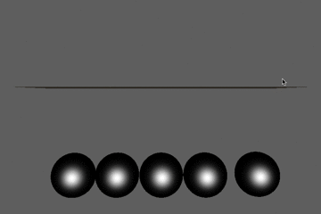
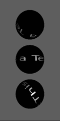

# OpenGL Usage

## First Project
In folder `/hw1`.

This project enables several functions in the displaying window.

* object rotation (up, down, left, right, M, N keys)
* object movement (W, S, A, D, Z, X keys)
* display mode selection (P, F, L, O keys)
* color gradual change (R, G, B keys)

### Display Mode Selection
P: only display points
F: display triangles, in random colors
L: only display lines
O: display both triangle faces and lines

### Color Gradual Change
R, G, B represent red, green, and blue elements in the color, respectively. When we keep pressing R, for example, the red element will be fluctuating in a sinusoidal pattern. We can also press several keys at the same time.

## Second Project

This project displays an Archimedes' Screw. See folder `hw2` for details.

## Third Project

This project draws snow flakes with particle system.

## Fourth Project

(The gif is not showing text clearly due to optimization requirements for web browser downloading.)

In this project, we draw a mini Solar System in 3D space with flat pictures of these celestial bodies given.

* Each planet is rotating around the sun, the moon rotates around the earth.
* The name of each body follows it (text).
* We are able to navigate within this 3D space with keyboard and mouse pad.

## Fifth Project

In this project, we draw a [Bezier spline](https://en.wikipedia.org/wiki/B%C3%A9zier_curve) plane according to 25 control points.

We also utilize the **tessellation** introduced by openGL V4.0+.

## Seventh Project

FAQ:
Q: Where is the 6th project?
A: It's actually a design project, so, no coding :)

## Eigth Project: Simple Physics Engine

### Notice
This project is the homework assignment of a CMU course __Computer Aided Design__. You can find the instructions of this project from the files additionalMaterial.pdf and README. Note that quite some libraries have to be installed properly on your computer before you can run `make`. The makefile is only composed for Mac, and need to be changed a bit for Linux or Windows systems.

### Usage
On my mac, with [libpng](http://www.libpng.org/pub/png/libpng.html)(ONLY version 12!) installed under lib/lib (already contained in the folder), first run `source compile.sh`.

After that, as long as you keep the terminal open, you should only need to run `make` to compile new changes and run `./physics scenes/The_scene_you_want_to_load`.